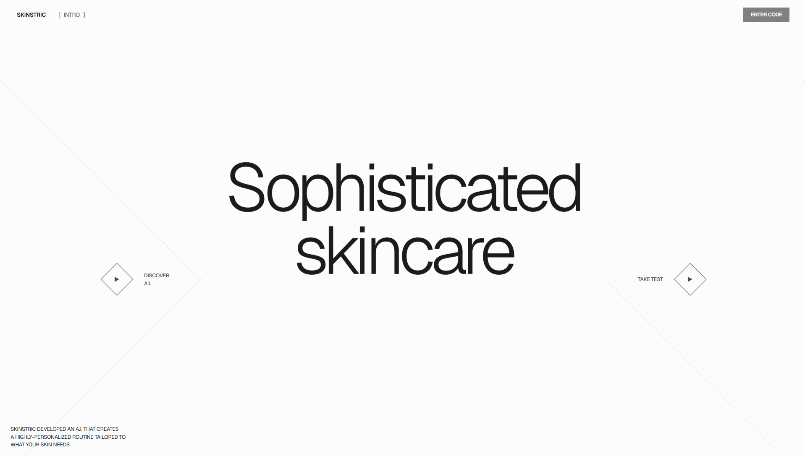
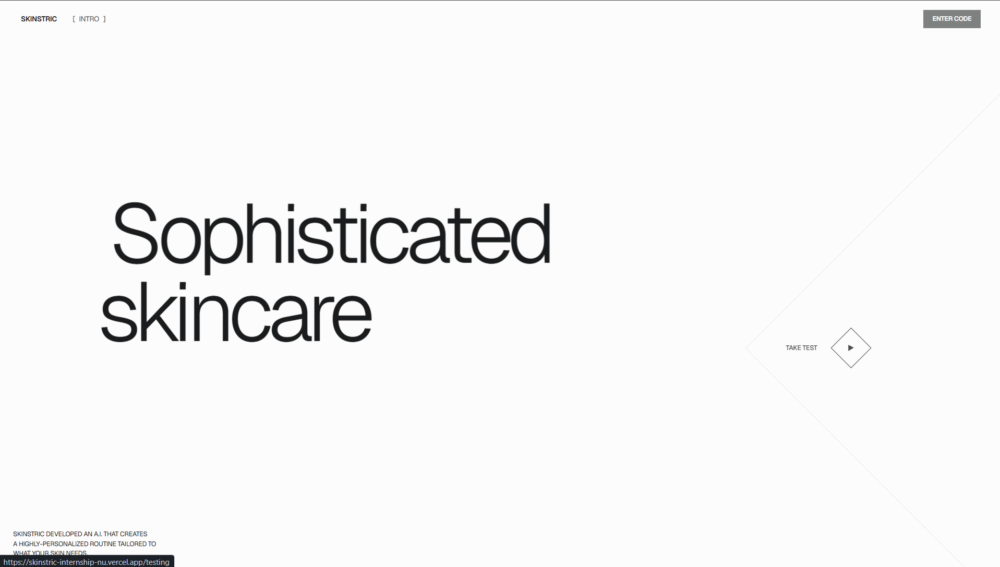
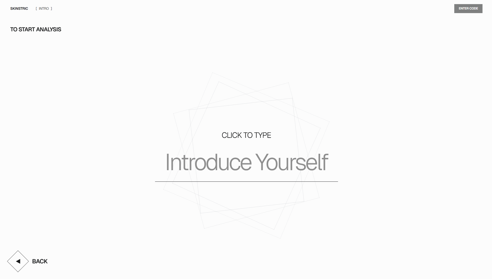
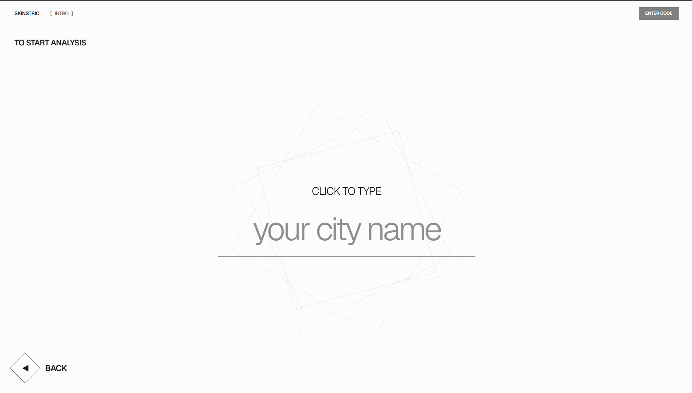
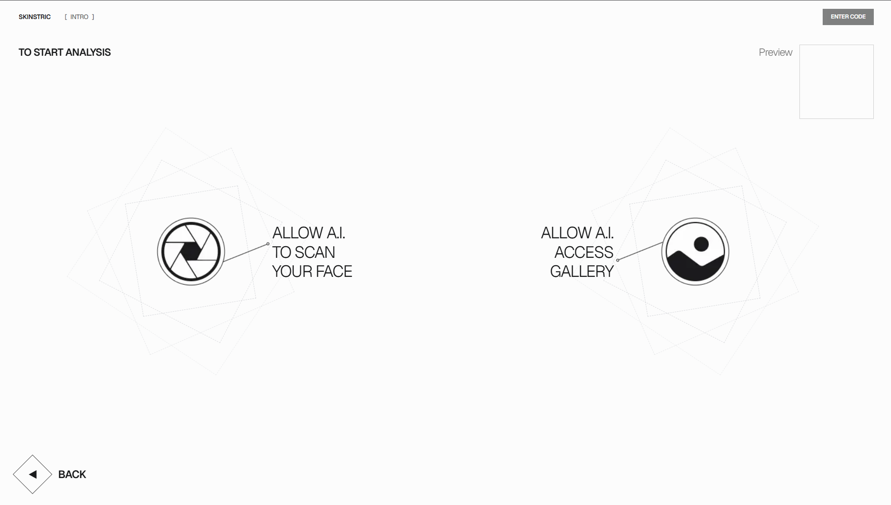
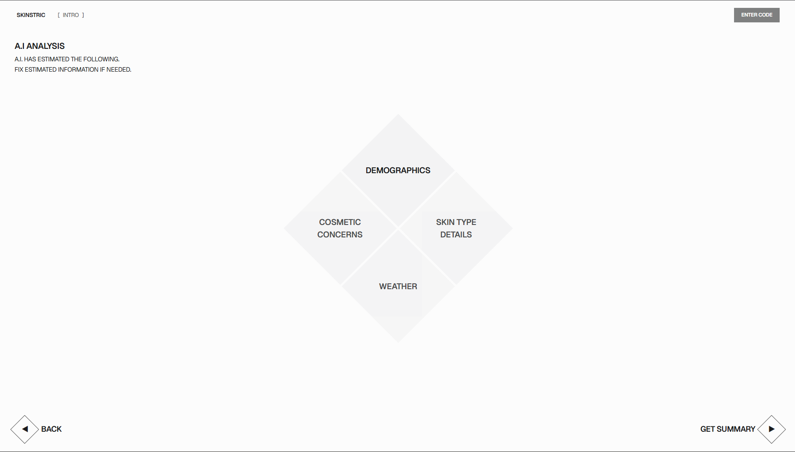
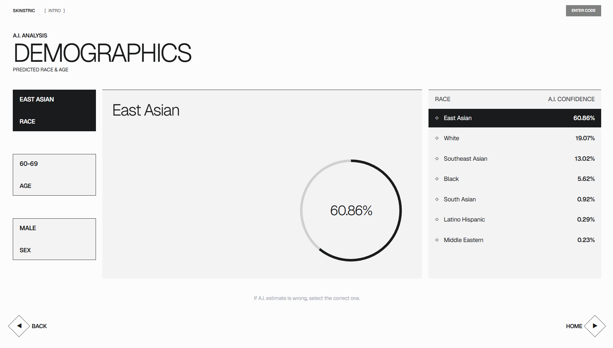

# Skinstric AI Skincare Analysis

Skinstric AI Skincare Analysis is an interactive web app for users who want a guided skincare assessment flow before reviewing AI-inspired analysis results. It solves the portfolio challenge of turning a static design brief into a responsive, multi-step product experience using Next.js, React, TypeScript, Tailwind CSS, browser media APIs, and external API integration.

**Live Demo:** [https://skinstric-internship-nu.vercel.app/](https://skinstric-internship-nu.vercel.app/)  
**GitHub:** [https://github.com/muh-dixon/skinstric-internship](https://github.com/muh-dixon/skinstric-internship)

## Screenshots

### Live Walkthrough

[Watch the demo video](docs/assets/demo/skincare-demo.mp4)

> GIF placeholder: add an optimized walkthrough GIF at `docs/assets/demo/skincare-demo.gif` if a lightweight animated preview is needed for the README.

### App Screens

| Home | Hover State |
| --- | --- |
|  |  |

| Name Step | Location Step |
| --- | --- |
|  |  |

| Capture Options | Results Overview |
| --- | --- |
|  |  |

| Demographics Detail |
| --- |
|  |

## Features

- Animated landing page with directional navigation and hover-driven transitions.
- Multi-step onboarding flow for name and location input.
- Client-side validation for user-provided onboarding details.
- Camera and gallery upload flow using browser media and file APIs.
- Integration with external Skinstric phase one and phase two API endpoints.
- Results dashboard with analysis categories for demographics, skin type, cosmetic concerns, and weather.
- Demographics detail view with confidence rankings and selectable corrections.
- Local storage persistence for submitted profile data and analysis results.
- Responsive layouts for desktop and mobile viewports.

## Tech Stack

- **Framework:** Next.js 16.2.3 App Router
- **UI:** React 19.2.4, TypeScript, Tailwind CSS 4
- **Animation:** Motion, AOS
- **Browser APIs:** MediaDevices, FileReader, Local Storage
- **Deployment:** Vercel
- **External APIs:** Skinstric phase one and phase two cloud function endpoints

## Architecture / How It Works

The app is organized around route-level experiences in the Next.js App Router:

- `src/app/page.tsx` renders the landing page and entry navigation.
- `src/app/testing/page.tsx` handles the onboarding form and phase one submission.
- `src/app/capture/page.tsx` manages camera access, gallery upload, preview, and phase two submission.
- `src/app/results/page.tsx` displays the analysis category dashboard from stored phase two results.
- `src/app/results/[category]/page.tsx` renders the demographics detail experience.
- `src/lib/analysis-content.ts` centralizes result parsing, category data, ranking helpers, storage keys, and fallback content.

The main user flow is:

1. User starts from the landing page.
2. User enters name and location.
3. The app submits phase one profile data to the external API.
4. User captures or uploads an image.
5. The app submits the image to the external phase two API.
6. Analysis data is saved in local storage.
7. Results pages read the stored response and render category summaries and demographic confidence rankings.

## Environment Variables

No environment variables are required for the current implementation. The external Skinstric API endpoints are referenced directly in the client flow.

If the project grows, API endpoints should be moved into environment variables such as:

```bash
NEXT_PUBLIC_PHASE_ONE_ENDPOINT=
NEXT_PUBLIC_PHASE_TWO_ENDPOINT=
```

## Getting Started

### Prerequisites

- Node.js 20.9 or newer
- npm

### Install Dependencies

```bash
npm install
```

### Run Locally

```bash
npm run dev
```

Open [http://localhost:3000](http://localhost:3000) in your browser.

### Build for Production

```bash
npm run build
```

### Start Production Server

```bash
npm run start
```

### Lint

```bash
npm run lint
```

## What I Learned

- How to translate a polished design reference into reusable route-level UI in Next.js.
- How to manage multi-step client flows with validation, loading states, and navigation.
- How to work with camera access, file uploads, and base64 image normalization in the browser.
- How to integrate external API responses into a frontend experience.
- How to handle client-only browser APIs safely in a Next.js App Router project.
- How to structure result data so the dashboard and detail pages can share parsing and ranking logic.

## Future Improvements

- Move external API endpoint URLs into environment variables.
- Add automated tests for validation, result parsing, and route behavior.
- Add a lighter optimized GIF preview for the README.
- Improve error states for unavailable camera permissions and failed API responses.
- Expand the result detail pages for skin type, cosmetic concerns, and weather.
- Add accessibility passes for keyboard focus order and screen reader labels.
